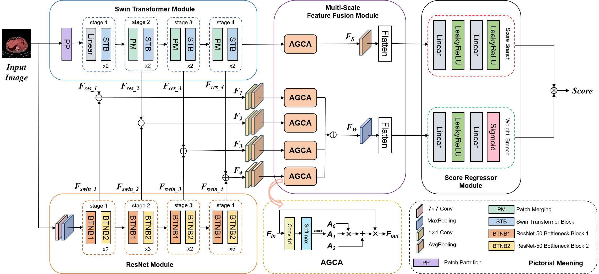

# MS-IQA: A Multi-Scale Feature Fusion Network for PET/CT Image Quality Assessment

## Requirements and Dependencies

* Python 3.8.10
* Pytorch 2.4.1
* Torchvision 0.19.1
* Numpy 1.22.0

## Overview of MS-IQA


## Usage
```
python MSIQA_test.py
```

